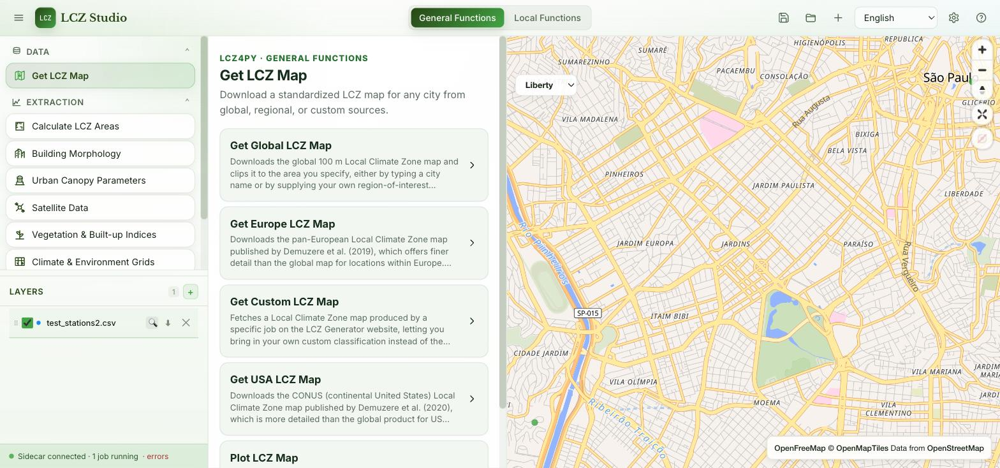
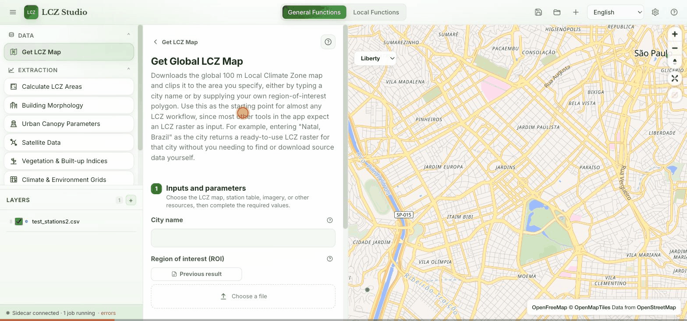

# LCZ Studio

A free and open-source, cloud-native GIS platform for visualizing, exploring, and analyzing Local Climate Zones (LCZ), built on the [LCZ4py](https://github.com/ipeaGIT/lcz4r) Python package. Runs as a desktop app (macOS, Windows, Linux) or in the browser.





## 📥 Download

Get the latest desktop build from the [Releases page](https://github.com/ByMaxAnjos/lcz-studio/releases/latest) — no build tools required.

| Platform | Download |
|----------|----------|
| 🍎 macOS (Apple Silicon) | [LCZ Studio.dmg](https://github.com/ByMaxAnjos/lcz-studio/releases/download/v0.1.0/LCZ.Studio_0.1.0_aarch64.dmg) |
| 🪟 Windows (x64) | [LCZ Studio Setup.exe](https://github.com/ByMaxAnjos/lcz-studio/releases/download/v0.1.0/LCZ.Studio_0.1.0_x64-setup.exe) |
| 🐧 Linux (.deb) | [LCZ Studio.deb](https://github.com/ByMaxAnjos/lcz-studio/releases/download/v0.1.0/LCZ.Studio_0.1.0_amd64.deb) |
| 🐧 Linux (AppImage) | [LCZ Studio.AppImage](https://github.com/ByMaxAnjos/lcz-studio/releases/download/v0.1.0/LCZ.Studio_0.1.0_amd64.AppImage) |

**First-run notes** — the app isn't code-signed yet, so each OS will flag it once:

- **macOS**: right-click the app → **Open** → confirm in the dialog (Gatekeeper blocks a plain double-click). Or from Terminal: `xattr -cr "/Applications/LCZ Studio.app"`.
- **Windows**: SmartScreen may warn about an unrecognized publisher — click **More info → Run anyway**.
- **Linux**: make the AppImage executable first (`chmod +x LCZ.Studio_0.1.0_amd64.AppImage`) or install the `.deb` with your package manager.

## 🌍 Overview

LCZ Studio wraps the full [LCZ4py](https://github.com/ipeaGIT/lcz4r) function catalog — LCZ map generation, urban morphology, canopy parameters, remote sensing, spectral indices, gridded climate/environment data, station time series, thermal anomalies, urban heat island intensity, spatial/ML interpolation, drought indices, and thermal comfort — in one map-first interface. The catalog is introspected live from the installed LCZ4py version, so the UI stays in sync with it automatically.

- **Visualize** LCZ classifications and any GeoTIFF/GeoJSON layer on an interactive map
- **Run** any public LCZ4py function through an auto-generated form, no code required
- **Import** station CSV, GeoJSON, GeoPackage, and Shapefile data
- **Query** imported data with in-browser SQL via DuckDB-WASM
- **Export** plots, tables, rasters, and interactive HTML results

## 🚀 Features

- **Interactive mapping** — MapLibre GL JS, with GeoTIFF/COG rendering (WUDAPT-palette aware for LCZ classes) and drag-and-drop layer management
- **Full LCZ4py coverage** — every public function across the `general` and `local` modules, exposed automatically via the sidecar's catalog endpoint
- **In-browser SQL** — DuckDB-WASM Spatial for querying imported station/vector data
- **11 languages** — English, Português, Español, 中文, Français, Deutsch, 日本語, 한국어, العربية, Русский, हिन्दी (with automatic right-to-left layout for Arabic)
- **Light, Dark, and Dark Neutral themes**, plus a system-preference option
- **Project save/load** — a project file captures layers, map state, and settings for later

## 🏗️ Architecture

```
LCZ Studio
├── Frontend (React + TypeScript, Vite)
│   ├── UI (Toolbar, Sidebar, MainWorkspace, LayerManager, Settings)
│   ├── Map (MapLibre GL JS + GeoTIFF/COG rendering)
│   ├── Data (DuckDB-WASM Spatial, CSV/GeoJSON/GeoPackage/Shapefile import)
│   ├── LCZ4py Browser (renders a form from the sidecar's live function catalog)
│   ├── i18n (11 languages)
│   └── State (Zustand)
├── Desktop (Tauri v2 + Rust)
│   └── Bundles the frontend + Python sidecar into a native app
└── Sidecar (Python, FastAPI)
    └── Introspects and executes LCZ4py functions on request
```

## 📋 Tech Stack

| Layer | Technology | Purpose |
|-------|-----------|---------|
| **UI** | React 18, TypeScript, plain CSS | User interface |
| **Map** | MapLibre GL JS | Interactive mapping, GeoTIFF/COG rendering |
| **Data** | DuckDB-WASM Spatial | In-browser SQL queries |
| **Desktop** | Tauri v2, Rust | Cross-platform desktop app |
| **Analysis** | Python (FastAPI) + LCZ4py | LCZ analysis sidecar |
| **State** | Zustand | State management |
| **Build** | Vite, npm workspaces | Build tooling |

## 📦 Project Structure

```
lcz-studio/
├── frontend/                 # React + TypeScript frontend
│   └── src/
│       ├── components/        # UI components (Toolbar, Sidebar, MapCanvas, LayerManager, Lcz4pyBrowserPanel, Settings...)
│       ├── store/             # Zustand state management
│       ├── map/                # MapLibre integration + GeoTIFF/COG handling
│       ├── data/               # DuckDB-WASM + file import
│       ├── services/           # Sidecar client (catalog + function invocation)
│       ├── i18n/                # Translations (11 languages)
│       └── utils/               # LCZ palette, per-parameter help text, etc.
├── desktop/                   # Tauri v2 desktop app
│   ├── src-tauri/               # Rust shell
│   └── sidecar/                 # Python/FastAPI service wrapping LCZ4py
├── package.json                # Root monorepo config
└── README.md
```

## 🛠️ Building from Source

### Prerequisites

- Node.js 18+
- Rust (for desktop builds)
- Python 3.11+ (for the sidecar)

### Setup

```bash
git clone https://github.com/ByMaxAnjos/lcz-studio.git
cd lcz-studio
npm install
```

### Run in development

```bash
# Frontend only, in the browser (http://localhost:1420)
npm run dev:web

# Desktop app (requires the frontend dev server running)
npm run dev:desktop
```

### Build

```bash
# Web build → frontend/dist/
npm run build:web

# Desktop installers → desktop/src-tauri/target/release/bundle/
npm run build:desktop
```

There is no test runner currently configured for this project.

## 📖 Usage

1. Choose a workspace in the toolbar: **General Functions** (map-level LCZ4py tools) or **Local Functions** (station-based analysis).
2. Pick a tool from the sidebar — each opens a form generated straight from the LCZ4py function's real signature.
3. Import data (CSV, GeoJSON, GeoPackage, or Shapefile) via the Layers panel, or point a tool at a previous result.
4. Run the function; results render as a map layer, plot, table, or downloadable file depending on what LCZ4py returns.
5. Save your project from the toolbar to pick up where you left off later.

## 🌐 Multilingual Support

Switch languages from the toolbar's language selector: English, Português, Español, 中文, Français, Deutsch, 日本語, 한국어, العربية, Русский, हिन्दी.

## 📊 Station Data Format

Station CSV imports require these columns:

```csv
date,station,var,lat,lon
2024-01-01,Site A,25.3,-23.55,-46.63
2024-01-02,Site A,22.1,-23.55,-46.63
2024-01-03,Station B,28.7,-23.60,-46.70
```

`var` holds the numeric value for whatever variable you're analyzing (e.g. temperature); which column to treat as the value is chosen per function.

## 🤝 Contributing

Contributions are welcome:

1. Fork the repository
2. Create a feature branch (`git checkout -b feature/amazing-feature`)
3. Commit your changes (`git commit -m 'Add amazing feature'`)
4. Push the branch (`git push origin feature/amazing-feature`)
5. Open a Pull Request

## 📄 License

MIT License — see the LICENSE file for details.

## 🙏 Acknowledgments

- **[LCZ4py](https://github.com/ipeaGIT/lcz4r)** — Local Climate Zone analysis (Python port of LCZ4r)
- **MapLibre GL JS** — open-source mapping library
- **DuckDB** — in-process SQL OLAP database
- **Tauri** — lightweight cross-platform desktop framework

## 📞 Support

- **Issues**: [Report bugs or request features](https://github.com/ByMaxAnjos/lcz-studio/issues)
- **Discussions**: [Ask questions and share ideas](https://github.com/ByMaxAnjos/lcz-studio/discussions)

## 📝 Citation

If you use LCZ Studio or LCZ4py in your research, please cite:

```bibtex
@article{anjos2025lcz4py,
  title={LCZ4py: A Python package for Local Climate Zone analysis},
  author={Anjos, Max and others},
  journal={Scientific Reports},
  year={2025},
  doi={10.1038/s41598-025-92000-0}
}
```

Anjos, M. et al. (2025). LCZ4py: A Python package for Local Climate Zone analysis. *Scientific Reports*. https://www.nature.com/articles/s41598-025-92000-0

---

**Created by [Max Anjos](https://github.com/ByMaxAnjos)** · Departamento de Geociências, Universidade Federal de Juiz de Fora (UFJF), Brazil
